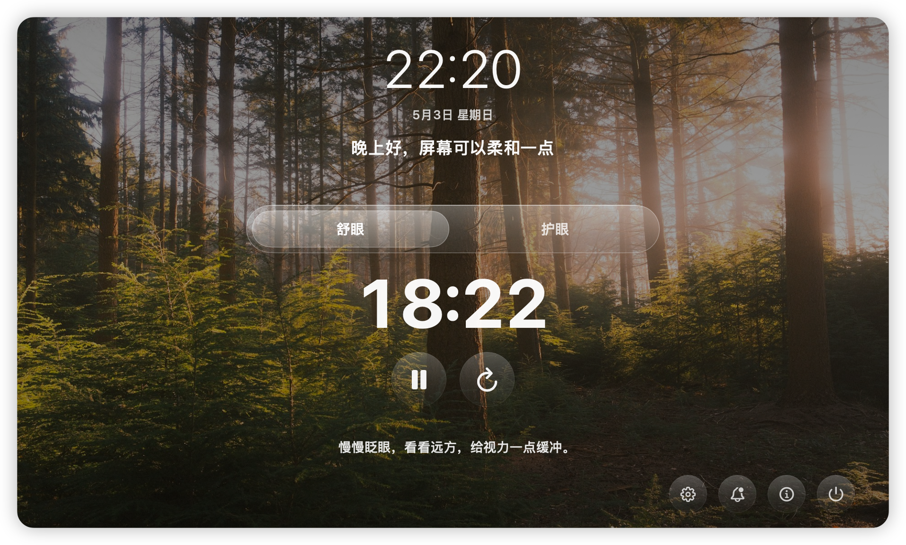
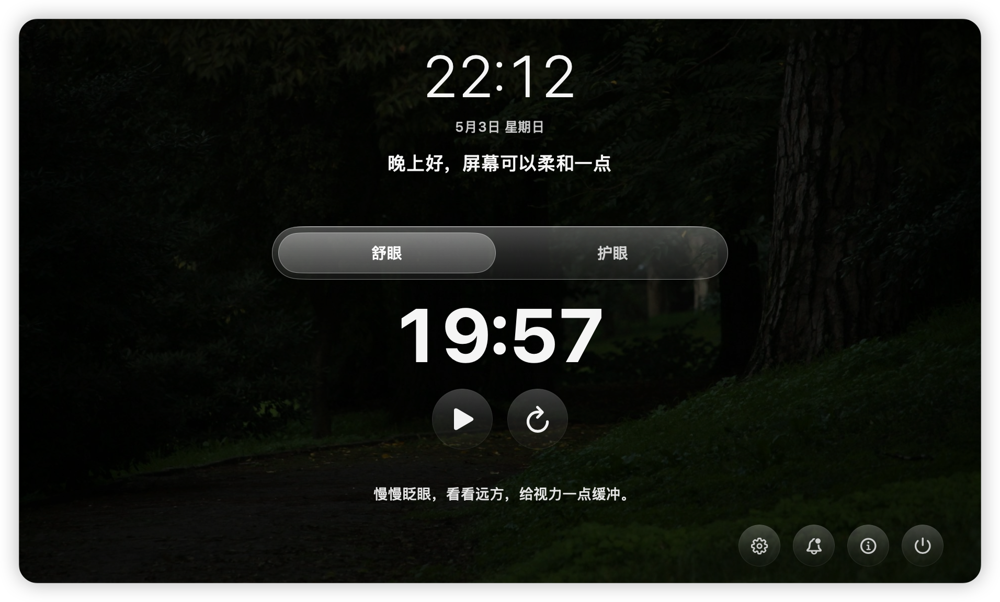
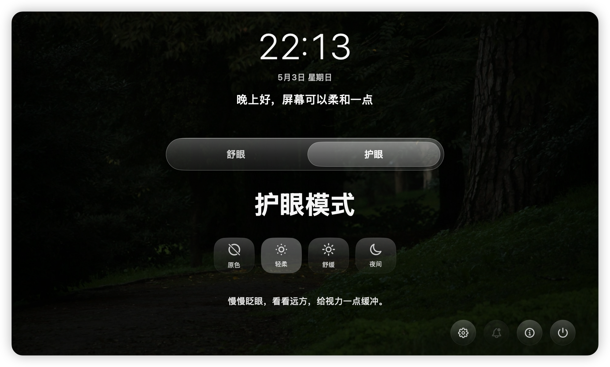
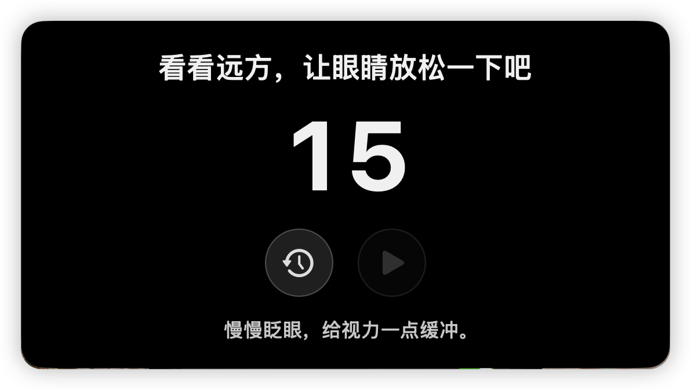
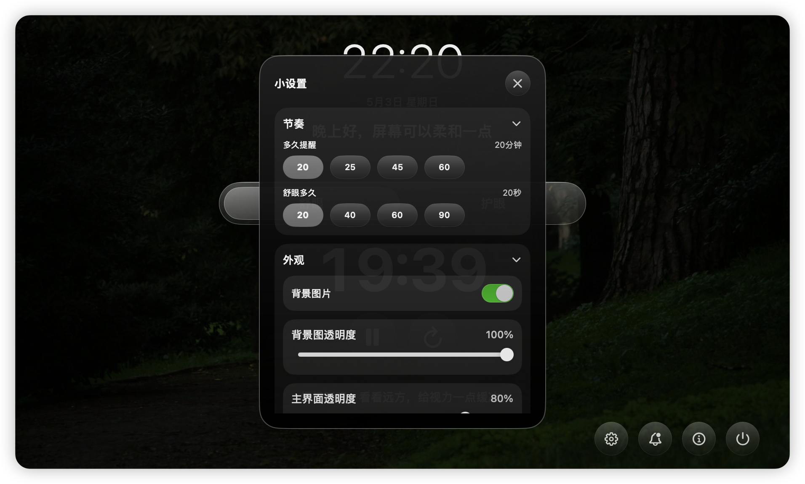

# ClearView

English | [简体中文](README.zh-CN.md)

[](#requirements)
[](#requirements)
[](LICENSE)



ClearView is a very minimalist macOS app that helps users maintain healthier screen-time rhythms with periodic eye-break reminders and blue-light filter controls.

> Current version: `0.2.2` (`release`)

## Table of Contents
- [ClearView](#clearview)
  - [Table of Contents](#table-of-contents)
  - [Features](#features)
  - [Requirements](#requirements)
  - [Install and Use](#install-and-use)
    - [Download from Releases](#download-from-releases)
    - [Bypass Gatekeeper](#bypass-gatekeeper)
    - [Start Using ClearView](#start-using-clearview)
    - [Default Shortcuts](#default-shortcuts)
  - [Quick Start (Xcode)](#quick-start-xcode)
  - [Build and Test](#build-and-test)
    - [Xcode](#xcode)
    - [DMG Packaging](#dmg-packaging)
  - [Project Structure](#project-structure)
  - [Configuration and Data](#configuration-and-data)
  - [Troubleshooting](#troubleshooting)
  - [Roadmap](#roadmap)
  - [Contributing](#contributing)
  - [Security](#security)
  - [Privacy](#privacy)
  - [Screens](#screens)
  - [License](#license)

## Features
- Minimalist style, supporting both dark and light modes, following the system.
- Menu bar based workflow with an independent main panel.
- Reminder lifecycle: work timer → preparation countdown → break countdown → completion.
- Reminder actions: complete now, snooze, and restart timing.
- Eye-care and Pomodoro rhythms: Eye Care reminds you on a fixed interval; Pomodoro runs focus/rest cycles and guides an eye break at the start of rest.
- Blue-light filter presets: `Off`, `Light`, `Medium`, `Night`.
- Multiple customizable global shortcuts.
- Local-only settings persistence via `UserDefaults`.

## Requirements
- macOS 13+

If you only want to install and use ClearView, you do not need Xcode or Swift.

## Install and Use

### Download from Releases
1. Open this repository’s **Releases** page.
2. Download the latest `ClearView-<version>.dmg`.
3. Double-click the DMG to open it.
4. Drag `ClearView.app` into the `Applications` folder.
5. Launch `ClearView` from `Applications`.

### Bypass Gatekeeper
The current release may not be signed and notarized with an Apple Developer account. On first launch, macOS may show a warning such as “Apple cannot check it for malicious software” or block the app.

Recommended path:
1. Open `Applications` in Finder.
2. Find `ClearView.app`, then Control-click or right-click it.
3. Choose **Open**.
4. Click **Open** again in the confirmation dialog.

If macOS still blocks the app, allow it in System Settings:
1. Try launching `ClearView` once from `Applications` so macOS creates a blocked-app record.
2. Open **System Settings**.
3. Go to **Privacy & Security**.
4. Scroll down to the **Security** section.
5. Find a message like “`ClearView` was blocked from use because it is not from an identified developer.”
6. Click **Open Anyway** or **Allow**.
7. Enter your Mac login password or confirm with Touch ID if prompted.
8. Launch `ClearView` again from `Applications`, then click **Open** in the confirmation dialog.

Do not disable Gatekeeper globally. Only allow this app if you trust the download source.

### Start Using ClearView
After launch, `ClearView` appears in the macOS menu bar. Click the menu bar icon to open the main panel, adjust reminder timing, switch blue-light filter presets, and open settings.

In rhythm settings, choose:
- **Eye Care**: remind yourself to look away from the screen on a fixed interval.
- **Pomodoro**: run focus/rest cycles. During rest, ClearView starts with a short eye-break guide instead of interrupting focus.

In preferences, you can enable launch at login and choose whether ClearView starts timing automatically after launch.

### Default Shortcuts
The default shortcuts are listed below and can be changed in settings:

| Action | Shortcut |
| --- | --- |
| Open main panel | `⌘⇧Space` |
| Pause/resume reminders | `⌘⇧P` |
| Snooze reminder | `⌘⇧S` |
| Switch Eye Relax/Pomodoro rhythm | `⌘⇧R` |
| Switch eye-care mode | `⌘⇧L` |

## Quick Start (Xcode)
The following steps are for developers.

Requirements:
- Xcode 15+ (recommended)
- Swift 5.9+

1. Open `ClearView.xcodeproj` in Xcode.
2. Select scheme `ClearView`.
3. Run (`⌘R`).
4. Click the menu bar icon and choose **打开 ClearView**.

## Build and Test

### Local Scripts
From the repository root:

```bash
./scripts/dev.sh build   # compile the Debug app
./scripts/dev.sh unit    # run unit tests only
./scripts/dev.sh test    # run unit and UI tests
./scripts/dev.sh run     # compile and launch ClearView
```

The scripts use `build/DerivedData` inside the project, so you do not need to open Xcode for normal development checks.

### Xcode
- Build: `Product -> Build`
- Run: `Product -> Run`
- Test: `Product -> Test`
- Archive: `Product -> Archive`

### DMG Packaging
From the repository root (runs `xcodebuild` Release, then writes `dist/ClearView-<version>.dmg`, version read from the built app’s `CFBundleShortVersionString`):

```bash
./scripts/create-dmg.sh
```

If you already built `ClearView.app` in Xcode, pass the path to skip the compile step:

```bash
./scripts/create-dmg.sh /absolute/path/to/ClearView.app
```

The default packaging flow uses `CODE_SIGNING_ALLOWED=NO`. For wider distribution, configure signing and notarization in Xcode and adjust your pipeline accordingly.

> Build policy: current releases are supported via Xcode / `xcodebuild` only, to ensure a complete macOS `.app` bundle (icon assets, bundle metadata, and packaging flow).

## Project Structure

```text
ClearView/
├── ClearView/                    # App source code
│   ├── ClearViewApp.swift        # App entry + app state orchestration
│   ├── MenuBarView.swift         # Menu bar menu UI
│   ├── ContentView.swift         # Main panel UI
│   ├── ReminderFloatingView.swift# Reminder popup UI
│   ├── GlobalShortcutManager.swift
│   ├── AppSettingsStore.swift    # Settings persistence + migration
│   ├── BlueLightFilterService.swift
│   ├── MainPanelController.swift
│   ├── SettingsPanelController.swift
│   ├── AboutPanelController.swift
│   ├── AppVersion.swift
│   └── Resources/                # Image assets (menu bar icon, backgrounds)
├── ClearViewTests/               # Unit tests
├── ClearViewUITests/             # UI tests
├── docs/
│   ├── README.md
│   └── CHANGELOG.md
├── CONTRIBUTING.md
├── SECURITY.md
├── Package.swift
└── LICENSE
```

## Configuration and Data
- User settings are stored locally in `UserDefaults`.
- No account system, cloud sync, or telemetry in `v0.2.2`.
- Shortcut and UI preference migrations are handled in `AppSettingsStore`.

## Troubleshooting
- **Menu bar icon not clear enough**: ensure the menu bar icon asset is a dedicated template-style icon (transparent background, simplified thick strokes).
- **Global shortcut registration fails**: choose another key combination in settings (some combos are reserved by macOS or other apps).
- **First launch blocked by macOS**: see [Bypass Gatekeeper](#bypass-gatekeeper), right-click `ClearView.app`, and choose **Open** to confirm once.

## Roadmap
See [docs/CHANGELOG.md](docs/CHANGELOG.md) for release notes and upcoming evolution from current baseline.

## Contributing
Contributions are welcome.

Before opening a PR, please read [CONTRIBUTING.md](CONTRIBUTING.md).

Recommended PR checklist:
- Keep changes focused and small.
- Update docs when behavior changes.
- Ensure build and tests pass.
- Avoid committing secrets or local environment files.

## Security
If you discover a vulnerability, please follow [SECURITY.md](SECURITY.md) and report it privately first.

## Privacy
- No account system.
- No cloud sync.
- No telemetry in `v0.2.2`.

## Screens






## License
Licensed under Apache License 2.0. See [LICENSE](LICENSE).
